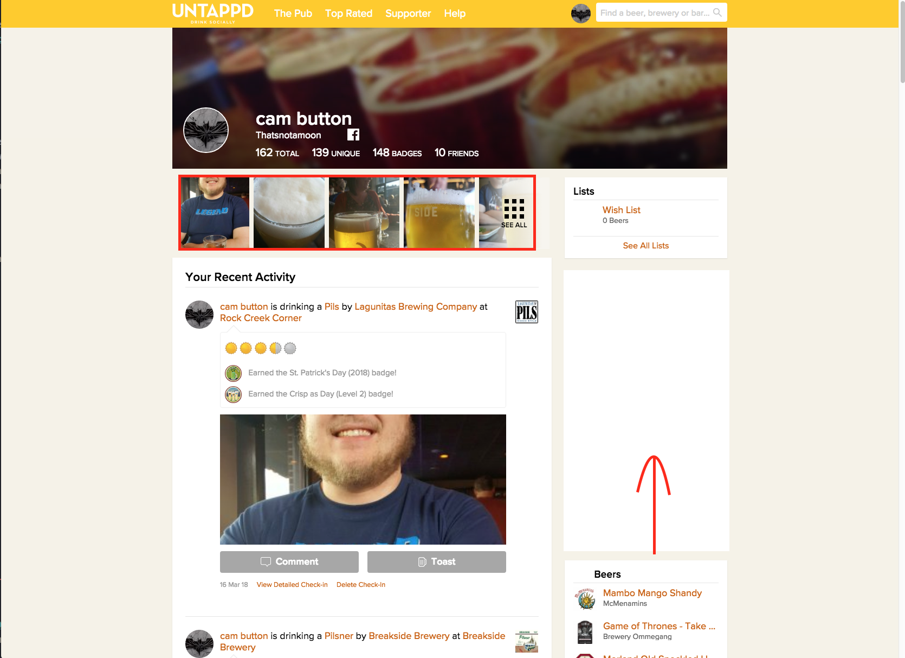
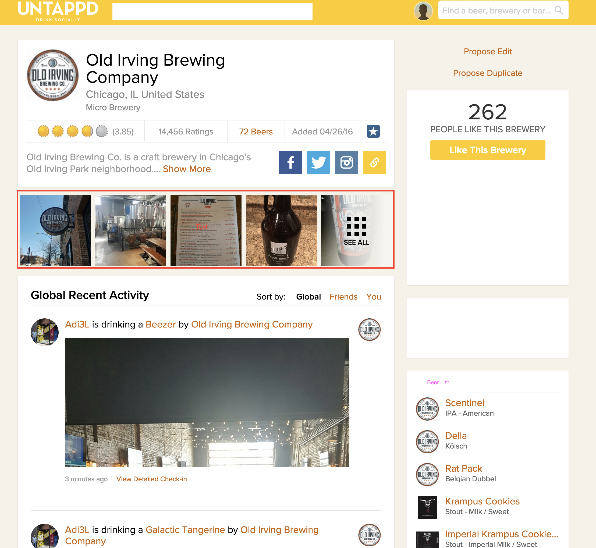

# UntappdClone :beer:

This project was generated with [Angular CLI](https://github.com/angular/angular-cli) version 1.7.4.

_Authored by Cameron Button, Ami Cooper, Kayl Eubanks, and Kristen Chellis_

## Description

  This App is designed to act like the untappd website/ app.  User's can log beers that they drink along with any comments about what they think about the beer.  Breweries can make their own accounts via the admin panel and list the beers they have for sale.

## Set up and installation

  * Follow this link https://untappd-clone.firebaseapp.com/

## User Stories

  * A user can search for breweries and see a list of beers
  * User can post about beers they are currently drinking
  * Breweries can make a list of their beers

  
  This is a rough draft of a user page.

  
  This is a rough draft of the brewery page.

## Development server

Run `ng serve` for a dev server. Navigate to `http://localhost:4200/`. The app will automatically reload if you change any of the source files.

## Code scaffolding

Run `ng generate component component-name` to generate a new component. You can also use `ng generate directive|pipe|service|class|guard|interface|enum|module`.

## Build

Run `ng build` to build the project. The build artifacts will be stored in the `dist/` directory. Use the `-prod` flag for a production build.

## Running unit tests

Run `ng test` to execute the unit tests via [Karma](https://karma-runner.github.io).

## Running end-to-end tests

Run `ng e2e` to execute the end-to-end tests via [Protractor](http://www.protractortest.org/).

## Further help

To get more help on the Angular CLI use `ng help` or go check out the [Angular CLI README](https://github.com/angular/angular-cli/blob/master/README.md).

### License

*MIT License

Copyright (c) [2018]

Permission is hereby granted, free of charge, to any person obtaining a copy
of this software and associated documentation files (the "Software"), to deal
in the Software without restriction, including without limitation the rights
to use, copy, modify, merge, publish, distribute, sublicense, and/or sell
copies of the Software, and to permit persons to whom the Software is
furnished to do so, subject to the following conditions:

The above copyright notice and this permission notice shall be included in all
copies or substantial portions of the Software.

THE SOFTWARE IS PROVIDED "AS IS", WITHOUT WARRANTY OF ANY KIND, EXPRESS OR
IMPLIED, INCLUDING BUT NOT LIMITED TO THE WARRANTIES OF MERCHANTABILITY,
FITNESS FOR A PARTICULAR PURPOSE AND NONINFRINGEMENT. IN NO EVENT SHALL THE
AUTHORS OR COPYRIGHT HOLDERS BE LIABLE FOR ANY CLAIM, DAMAGES OR OTHER
LIABILITY, WHETHER IN AN ACTION OF CONTRACT, TORT OR OTHERWISE, ARISING FROM,
OUT OF OR IN CONNECTION WITH THE SOFTWARE OR THE USE OR OTHER DEALINGS IN THE
SOFTWARE.*

Copyright (c) 2018 **_Cameron Button, Ami Cooper, Kayl Eubanks, and Kristen Chellis_**
